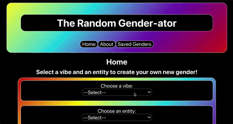
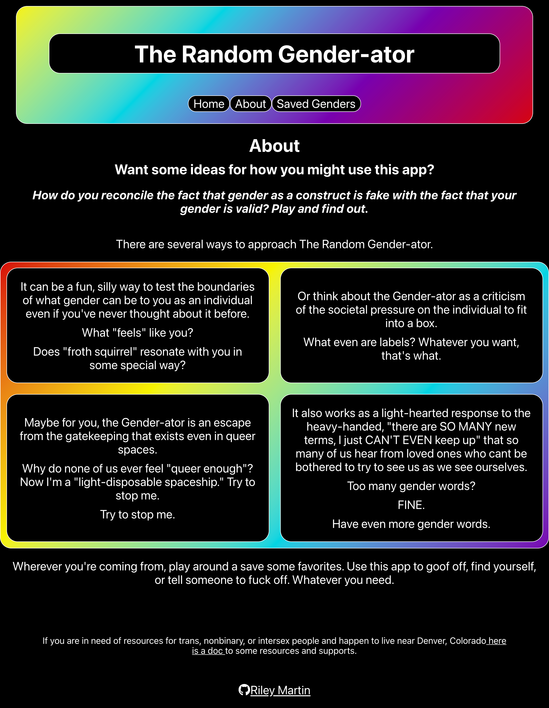
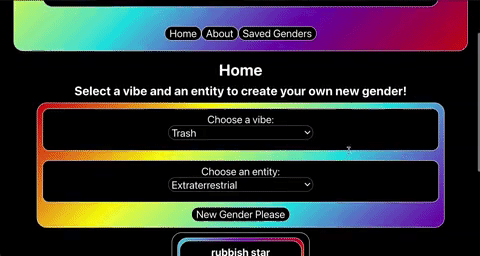
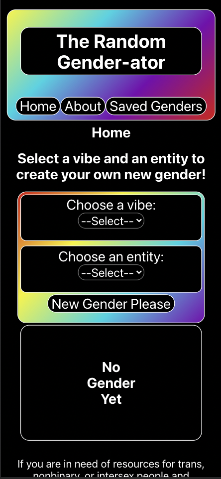
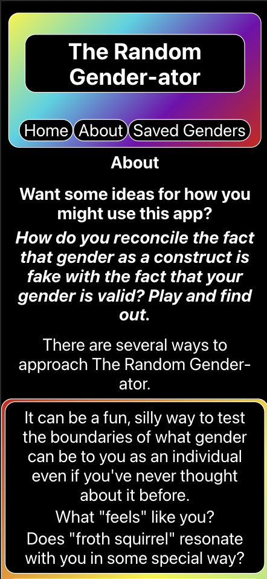
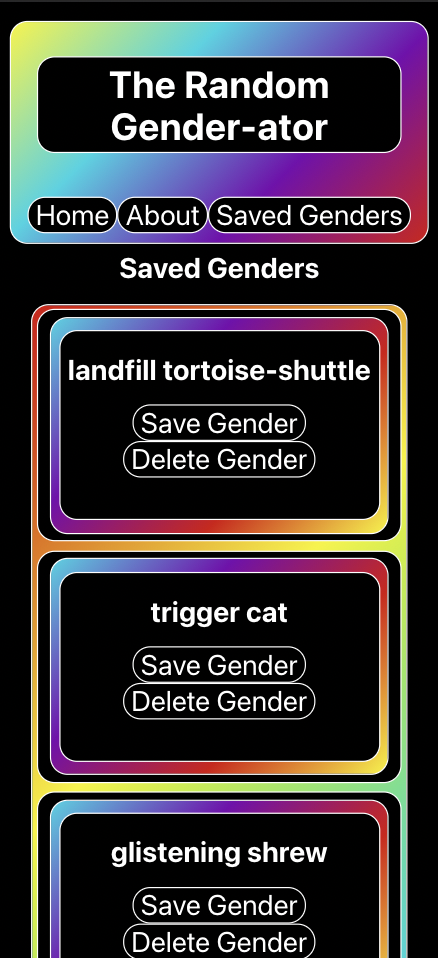

# The Random Gender-ator

## Table of Contents
* [Overview](#overview)
* [In Progress](#in-progress)
* [Deep Dive](#deep-dive)
* [Early Learning](#early-learning)
* [Authors](#authors)
* [Technologies](#technologies)

## Overview

### Links

#### Front End Deploy Link
https://the-random-gender-ator.herokuapp.com/

#### Back End Repository
https://github.com/RMartin0717/random-gender-ator-api

#### Back End Deploy Link
https://the-random-gender-ator-api.herokuapp.com/

### Description

This project was a final project assigned by [Turing School of Software and Design](www.turing.edu). I was given one week to design and produce an app for a niche audience and given full creative control of the design of the project. The app is built with React, React Router, tested with Cypress, and utilizes Travis CI.

On the home page, the user is able to interact with a gender generator which uses a [word association API](https://github.com/RMartin0717/random-gender-ator-api) that I built using Node.js with Express, Knex, and Postgres to create new genders related to user input. The niche audience for this app is queer people who are looking for new, non-academic words to help verbalize their identity or are tired of explaining gender to family who aren't listening anyway. The app is designed to be both fun and serve as a tool. A more in-depth description of possibles lenses through which to use the app lives in the "About" page and resources I compiled myself for queer people in Denver are linked in the footer of each page.

## In Progress

### Automatic Deployment for Patch Work

I am currently learning to set up automatic deployment with heroku and then will resolve the following issues.

- A major issue that I will be working on resolving is the screen reader and tabbing accessibility of the app. When I originally built out the app for a school project, I used https://coolors.co/ to check for color blindness accessibility and Lighthouse to run an accessibility audit. Since working for 9 months in a company following AA OWASP Guidelines and gaining a deeper knowledge of building accessible client-facing apps, I've learned how to more effectively test the accessibility of apps and found that this app is not tab and screen reader accessible. My most important next step for this app will be addressing this.

There are also a couple of minor issues to address with the app. 

- I think the overall design, which I did not spend as much time with when faced with a one week deadline, could use an update
- The title image needs to be updated so that it is a rainbow icon instead of the React logo.
- There is a sentence in the About page that is repeated and one needs to be removed.
- Intend to add aria attributes to HTML.
- Would like to update with newest versions of React and React Router.

## Deep Dive

### Notable features

 - Consumes data from its own API, built specifically for this app
 - Use of Router to enable user to navigate to multiple pages and to navigate using back and forward browser controls.
 - Tested with Cypress acceptance testing including the use of stubbed fetch data and happy/sad paths
 - Utilized responsive design for mobile or desktop viewing
 - Utilized a modular file structure for easy file navigation
 - The ability to create random genders using word association results from the connected API
 - The ability to save favorite genders to local storage and view them on a Saved Genders page
 - 100% Lighthouse accessibility audit

### Installation
1. Clone down this [repo](https://github.com/RMartin0717/random-gender-ator)
2. CD into project directory
3. Run npm i to install all project dependencies
4. Run npm start to begin the server
5. Application should be shown in separate window once npm start is complete

### Walkthrough

 - When you arrive on the homepage of the app, a fetch request will get and store word associations for "sparkle," "trash," "animal," and "extraterrestrial".  
 - The user will be able to select a vibe from a drop down menu and choose between "sparkle,"  "trash," or "a bit of both".
 - Then the user chooses an entity from a drop down menu from the options, "animal," "extraterrestrial," or "a bit of both."
 - Once both input fields are filled out, the user can click on "New Gender Please" and a gender created from random word associations for each of their selections appears on a card.
 - The user can then choose to save the new gender if they would like.
 - The user can click on "Saved Genders" in the header to view their saved genders and delete any they do not want anymore.
 - They may also click on the "About" Link to view information on ways in which they might choose to use the app for fun, for exploration, or as a coping mechanism.
 - The footer of the app contains a link to resources that I complied for trans, nonbinary, and intersex people who live near Denver, Colorado.

#### Desktop Home Page

#### Desktop About Page

#### Desktop Saved Genders Page

#### Mobile Home Page

#### Mobile About Page

#### Mobile Saved Genders Page

## Early Learning

### Learning Goals

My learning goal for this project was to solidify mastery of React, Router, Asynchronous JavaScript, and End to end testing with Cypress.

### Project Progression

At the beginning of the front end portion project, I felt very confident with Cypress testing, relatively confident with Asynchronous Javascript, and wanted to make sure I took the time to gain a deeper understanding with Router.

The app was originally built using a third party API to supply word associations. I planned my project to front-load the functionality of the app, knowing that I would be traveling and working in an unfamiliar place for the second half of the week. On the first day, I spent the morning exploring APIs and testing them to see what would work best for the project. Once I found one that provided the data I wanted, I immediately got to work on building out the React app with fetch calls to get the data and store it to use as I built out functionality. In a matter of a few days, I was able to build out all of the app functionality and then spend the rest of the time end-to-end testing, implementing page design, and managing error handling.

### Reflection

This project was perfect for solidifying what I learned over the course of mod 3 (a block of 6 weeks) of the Turing front end program. I do feel that I met my learning goals and feel more confident, efficient, and comfortable building a React app from scratch and independently.

I had a lot of fun building this app as the first app that I genuinely feel my friends will enjoy using. Having the framing of "what does this person need from this app?" made it easier to plan and shift gears when necessary and I really enjoyed that aspect of the development. I am particularly excited in the future to develop apps with specific users in mind because it helped me understand the why behind everything I was doing and I felt more invested in the product.

## Authors
<table>
    <tr>
        <td> Riley Martin <a href="https://github.com/RMartin0717">GH</td>
    </tr>
    </tr>
        <td></td>
    </tr>
</table>

## Technologies
<table>
    <tr>
        <td>Framework</td>
        <td>Functionality</td>
        <td>Structure</td>
        <td>Styling</td>
        <td>Continuous Integration</td>
    </tr>
    </tr>
        <td></td>
        <td></td>
        <td></td>
        <td></td>
        <td></td>
    </tr>
</table>
